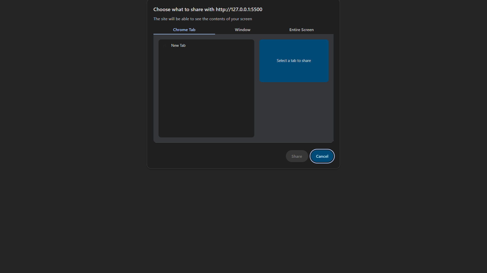
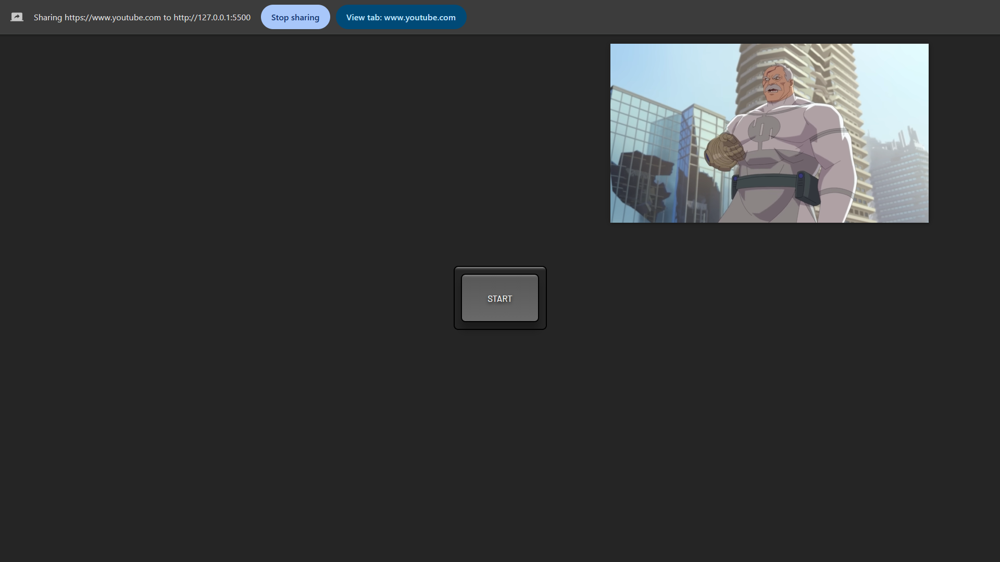

# Picture-in-Picture Project

A simple **Picture-in-Picture** project that allows users to pop out a selected video into a floating, resizable window using the **Picture-in-Picture API**.

## 🚀 Features
- Enables floating video playback
- Works with any video source
- User-friendly and minimal UI
- Built using **HTML, CSS, and JavaScript**

## 🎥 Demo




## 🛠️ Technologies Used
- HTML
- CSS
- JavaScript
- Picture-in-Picture API

## 📸 How It Works
1. Select a video source.
2. Click the **Enable Picture-in-Picture** button.
3. The video will pop out into a floating, always-on-top window.
4. Control playback within the floating window.


## 🖥️ Setup & Usage
1. Clone the repository:
   ```sh
   git clone https://github.com/Khairul25556/picture-in-picture.git
   ```
2. Open `index.html` in a browser.
3. Click the button to enable Picture-in-Picture mode.

## 🌟 Contributing
Pull requests are welcome! If you find an issue, feel free to open an issue or submit a PR.
